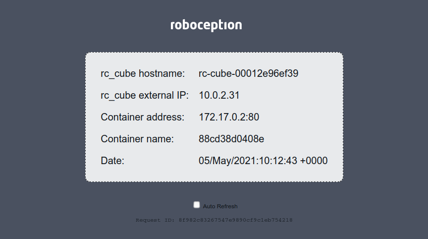

hello_rc_cube
=============

Simple docker container as rc_cube userspace example based on [nginx-hello](https://github.com/nginxinc/NGINX-Demos/tree/master/nginx-hello).

The image is available on Docker Hub: https://hub.docker.com/r/roboception/hello_rc_cube

When running in the rc_cube userspace, it will query the [rc_cube REST-API](https://doc.rc-cube.com/latest/en/rest_api.html) and display the hostname and external IP of the rc_cube along information of the container application.

To access the web page, the port 80 in the container needs to be mapped to any free host (rc_cube) port.
This can either be a manually chosen fixed port or an automatically published random port.
The image has the label `com.roboception.app.http`, which will tell the rc_cube that the protocol for the mapped host port is http.

